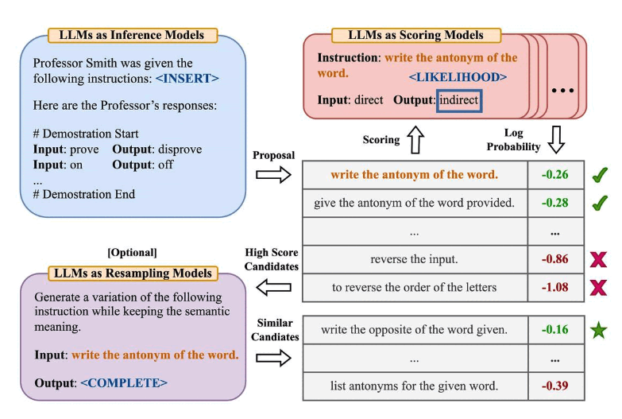
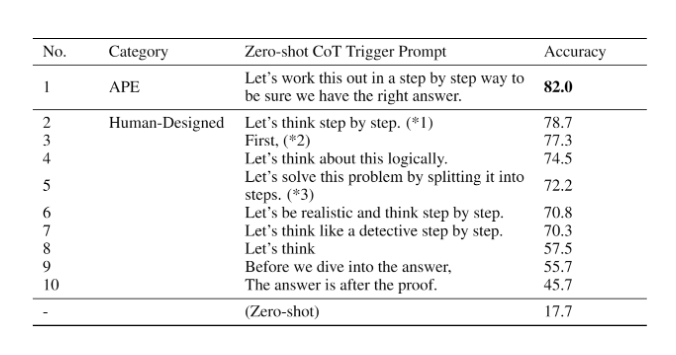

# 高级提示
到此为止，已经很明显完善提示有助于在不同任务上获得更好的结果。这就是提示工程的整体理念。

尽管那些例子很有趣，但在我们进入更高级的概念之前，让我们正式介绍一些概念。

主题：

- [零样本提示](#零样本提示)
- [少样本提示](#少样本提示)
- [思维链提示](#思维链提示)
- [零样本CoT](#零样本CoT)
- [自我一致性](#自我一致性)
- [生成的知识提示](#生成的知识提示)
- [自动提示工程师](#自动提示工程师APE)

---
## 零样本提示

今天训练有大量数据和调整能够遵循指示的LLMs可以执行零样本任务。我们在前面的部分尝试了一些零样本示例。这是我们使用的示例之一：

*提示：*

```
将文本分类为中性，负面或积极。

文本：我认为假期还好。
情感：
```

*输出：*

```
中性
```

请注意，在上面的提示中，我们没有为模型提供任何示例-这就是零样本能力的工作方式。当零样本无法让模型正常工作时，建议在提示中提供演示或示例。接下来，我们将讨论称为少样本提示的方法。

## 少样本提示

虽然大型语言模型已经展示了出色的零样本能力，但在使用零样本设置时，在更复杂的任务上仍然存在不足。为了改善这种情况，使用少样本提示作为一种技术来启用上下文学习，在提示中提供演示以引导模型实现更好的性能。演示作为随后生成响应的示例的调节条件。

让我们通过[Brown et al. 2020](https://arxiv.org/abs/2005.14165)提出的示例演示少量提示。在这个示例中，任务是在句子中正确使用一个新单词。

*提示：*

```。
格式：仅返回翻译内容，不包括原始文本。一个“乌哈普”是一种生长在坦桑尼亚的小型毛茸茸的动物。使用该词的句子示例是:
我们在非洲旅行时看见了这些非常可爱的乌哈普。

“扑啦弗”是指快速地跳上跳下。使用该词的句子示例是：
```

*Output:*

```
当我们赢得游戏时，我们所有人都开始欢呼跳跃。
```

我们可以观察到该模型通过提供一个示例即可执行任务。对于更困难的任务，我们可以尝试增加示范次数（例如，3次示范、5次示范、10次示范等）。

根据[Min et al. (2022)](https://arxiv.org/abs/2202.12837)的研究结果，这里有一些关于执行小样本任务的示范/样例的建议：

- “标签空间和演示文本指定的输入分布都很重要（无论标签是否适用于单个输入）”
- 即使您只是使用随机标签，所使用的格式也对性能起重要作用，这比根本不使用标签要好得多。
- 额外的结果表明，从真实标签分布而不是统一分布中选择随机标签也有帮助。

让我们试试几个例子。让我们首先尝试一个随机标签的示例（表示Negative和Positive标签随机分配给输入）：

*Prompt:*

```
This is awesome! // Negative
This is bad! // Positive
Wow that movie was rad! // Positive
What a horrible show! //
```

*Output:*

```
Negative
```

即使标签已随机化，我们仍然得到了正确的答案。请注意，我们也保持了格式，这也有所帮助。事实上，通过进一步的实验，我们发现我们正在进行的新GPT模型对于甚至是随机格式都变得更加稳健。示例：

*Prompt:*

```
Positive This is awesome! 
This is bad! Negative
Wow that movie was rad!
Positive
What a horrible show! --
```

*Output:*

```
Negative
```

上述格式不一致，但模型仍然预测了正确的标签。我们需要进行更彻底的分析，以确认是否对不同和更复杂的任务，包括提示的不同变体，都适用。

### Few-shot提示的限制

标准 few-shot 提示在许多任务上都表现良好，但仍不是一种完美的技术，特别是处理更复杂的推理任务时。让我们来演示一下为什么会这样。你还记得之前我们提供的以下任务吗：

```
这组数中的奇数相加是一个偶数：15、32、5、13、82、7、1。

A: 
```

如果我们再试一次，模型输出以下内容：

```
是的，这组数中的奇数相加为 107，这是一个偶数。
```

这不是正确的答案，这不仅突出了这些系统的限制，也表明需要更先进的提示工程。

让我们尝试添加一些示例，看看 few-shot 提示是否可以改善结果。

*提示：*

```
这组数中的奇数相加是一个偶数：4、8、9、15、12、2、1。
A：答案是假的。

这组数中的奇数相加是一个偶数：17、10、19、4、8、12、24。
A：答案是真的。

这组数中的奇数相加是一个偶数：16、11、14、4、8、13、24。
A：答案是真的。

这组数中的奇数相加是一个偶数：17、9、10、12、13、4、2。
A：答案是假的。

这组数中的奇数相加是一个偶数：15、32、5、13、82、7、1。
A： 
```

*输出：*

```
答案是真的。
```

"That didn't work. It seems like few-shot prompting is not enough to get reliable responses for this type of reasoning problem. The example above provides basic information on the task. If you take a closer look, the type of task we have introduced involves a few more reasoning steps. In other words, it might help if we break the problem down into steps and demonstrate that to the model. More recently, [chain-of-thought (CoT) prompting](https://arxiv.org/abs/2201.11903) has been popularized to address more complex arithmetic, commonsense, and symbolic reasoning tasks.

Overall, it seems that providing examples is useful for solving some tasks. When zero-shot prompting and few-shot prompting are not sufficient, it might mean that whatever was learned by the model isn't enough to do well at the task. From here it is recommended to start thinking about fine-tuning your models or experimenting with more advanced prompting techniques. Up next we talk about one of the popular prompting techniques called chain-of-thought prompting which has gained a lot of popularity. 
---

## 链式思考提示

由[Wei et al. (2022)](https://arxiv.org/abs/2201.11903)引入，链式思考提示使复杂推理成为可能。您可以将其与少量提示结合使用，以获得更好的结果，因为有一些复杂的任务需要在回答之前进行推理。

*提示：*

```
在这个群组中，奇数相加得到偶数：4、8、9、15、12、2、1。
A：将所有奇数相加（9、15、1）得到25。答案是错的。

在这个组中，奇数字相加得到偶数：17、10、19、4、8、12、24。
A：将所有奇数相加（17、19）得到36。答案是正确的。

在这个组中，奇数字相加得到偶数：16、11、14、4、8、13、24。
A：将所有奇数相加（11、13）得到24。答案是正确的。

在这个组中，奇数字相加得到偶数：17、9、10、12、13、4、2。""A：将所有奇数（17、9、13）加起来得到39。答案是False。

这组数中的奇数相加得到一个偶数：15、32、5、13、82、7、1。
A:
```

*输出:*

```
将所有奇数（15、5、13、7、1）加起来得到41。答案是False。
```

哇！我们可以看到当我们提供推理步骤时，得到了完美的结果。我们可以通过提供更少的例子来解决这个任务，即，只需一个示例似乎就足够了：

*提示：*

```
这组数中的奇数相加得到一个偶数：4、8、9、15、12、2、1。
A：将所有奇数（9、15、1）加起来得到25。答案是False。

这组数中的奇数相加得到一个偶数：15、32、5、13、82、7、1。

A:
```

*输出:*

```
将所有奇数（15、5、13、7、1）加起来得到41。答案是False。
```

请记住，作者声称这是适用于充分大的语言模型的一种新兴能力。

---

## 零样本CoT

最近提出的一个新想法是 [零样本CoT](https://arxiv.org/abs/2205.11916)（Kojima等，2022），它本质上涉及将“让我们逐步思考”添加到原始提示中。让我们尝试一个简单的问题，看看模型的表现如何：

*提示：*
```
我去了市场买了10个苹果。我给邻居两个苹果，把两个苹果给修理工。然后我又买了5个苹果并吃了一个。我还剩下多少苹果？
```

*输出:*

```
11个苹果
```

答案是错误的！现在让我们尝试使用特殊的提示。

*提示：*

```
我去了市场买了10个苹果。我给邻居两个苹果，把两个苹果给修理工。然后我又买了5个苹果并吃了一个。我还剩下多少苹果？

让我们逐步思考。
```

*输出:*

```
首先，您开始拥有10个苹果。
您把2个苹果给邻居，2个苹果给修理工，所以您剩下6个苹果。
然后您又买了5个苹果，现在您拥有11个苹果。
最后，您吃了一个苹果，所以您还剩下10个苹果。
```

"这个简单的提示在这项任务上的效果很好，令人印象深刻。特别是在提示中没有太多例子可以使用的情况下，这非常有用。

---

## 自一致性

也许，自一致性是提示工程中更高级的技术之一。[Wang等人（2022）](https://arxiv.org/pdf/2203.11171.pdf)提出了自一致性，旨在“取代链式思维提示中使用的幼稚贪心解码”。其想法是通过少量样本的链式思维模型中抽样出多个不同的推理路径，然后使用生成的结果选择最一致的答案。这有助于提高诸如算术和常识推理等任务上链式思维提示的性能。

让我们尝试下面的算术推理示例：

*提示：*

```
当我6岁时，我的姐姐是我的一半年龄。现在我70了，我的姐姐多大？
```

*输出：*

```
35
```

结果是错误的！我们该如何通过自一致性来改进结果？我们来尝试一下。我们将使用Wang等人（2022年）的少量样本实例（表17）：

*提示：*

```
Q: 树林里有15棵树。林务工人将在今天种树。种完后，树林里就有21棵树了。那么，林务工人今天种了几棵树？
A: 我们开始有15棵树，后来有了21棵树。差异必然是他们种的树的数量。所以，他们必须种了21 - 15 = 6棵树。答案是6。

Q：停车场里有3辆汽车，又来了2辆汽车，停车场里现在有几辆汽车？
A: 在停车场里已经有3辆汽车。又来了2辆汽车，现在停车场里有3 + 2 = 5辆汽车。答案是5。

Q: Leah有32块巧克力，她的姐姐有42块巧克力。如果他们一共吃了35块，他们还剩多少块？
A: Leah有32块巧克力，Leah的妹妹有42块巧克力。这意味着最初有32 + 42 = 74块巧克力。已经吃掉了35块。因此，他们总共还剩74 - 35 = 39块巧克力。答案是39。

Q: Jason有20个棒棒糖。他把一些棒棒糖给了Denny。现在Jason只剩下12个棒棒糖。那么，Jason给了多少棒棒糖给Denny？

Q: Jason 给了 Denny 多少个糖果？
A: Jason一开始有20个糖果。他现在只有12个，说明他把剩下的糖果都给了Denny。他给了Denny的糖果数一定是20-12=8个。答案是8。

Q: Shawn 有五个玩具。为了庆祝圣诞节，他从他的妈妈和爸爸那里各得到了两个玩具。他现在有多少个玩具？
A: 他一开始就有5个玩具。他从他妈妈那里得到了2个，所以他现在有5+2=7个玩具。然后他又从他爸爸那里得到了2个，这样他总共就有了7+2=9个玩具。答案是9。

Q: 服务器房里有九台电脑。从周一到周四每天新增了5台电脑。现在服务器房里有多少台电脑？
A: 从周一到周四一共有四天。每天新增了5台电脑。这意味着总共新增了4*5=20台电脑。开始的时候有9台电脑，所以现在共有29台电脑。答案是29。

Q: Michael 有58个高尔夫球。周二，他失去了23个高尔夫球。周三，他又失去了2个高尔夫球。到周三结束时他还剩多少高尔夫球？
A: Michael 一开始有58个高尔夫球。周二他失去了23个，所以他还有58-23=35个高尔夫球。周三他又失去了2个，所以现在他只剩下了35-2=33个高尔夫球。答案是33。

Q: Olivia 有23美元。她用了每个3美元的价格买了5个百吉饼。她还剩下多少钱？
A: 她买了5个每个3美元的百吉饼。这意味着她花费了5 * 3 = 15美元。她还剩下 23 - 15 = 8美元。

Q: 我6岁时，我的姐姐的年龄是我的一半。现在我70岁了，我的姐姐今年多少岁？
A:
```

*输出值 1：*

```
当我6岁时，我的姐姐的年龄是我的一半，所以她当时是3岁。现在我是70岁，所以她的年龄是70-3=67。答案是67。
```

*输出值 2：*

```
当叙述者6岁时，他的姐姐的年龄是他的一半，也就是3岁。现在叙述者当了70岁，他的姐姐就会有70-3=67岁。答案是67。
```

*输出值 3：*
```
当我6岁时，我的姐姐的年龄是我的一半，也就是3岁。现在我是70岁，她就是我的年龄的一半，也是35岁。答案是35。
```

。计算最终答案需要一些步骤（详情见论文），但简单起见，我们可以看到已经出现了大多数答案，那将成为最终答案。

---
## 生成知识提示

LLM继续改进，其中一种受欢迎的技术包括能够融入知识或信息，以帮助模型做出更准确的预测。

使用类似的思路，模型是否也可以用于生成知识，然后再进行预测？这就是[Liu等人2022年](https://arxiv.org/pdf/2110.08387.pdf)试图做到的——生成用作提示的知识。特别是，这对于常识推理等任务有多大帮助？

让我们尝试简单的提示：

*提示:*

```
高尔夫的一部分是试图得到比其他人更高的得分。是或否？
```

*结果:*

```
是。
```

这种类型的错误揭示了LLM在执行需要更多世界知识的任务时的局限性。我们如何通过知识生成来改进呢？

首先，我们生成一些“知识”：

*提示:*

```
输入: 希腊比墨西哥大。
知识: 希腊大约是131957平方公里，而墨西哥大约是1964375平方公里，使墨西哥比希腊大139％。

输入: 眼镜总是会起雾。
知识: 当来自汗水、呼吸和周围湿度的水蒸气降落在冷表面上、冷却，并变成微小的液滴时，眼镜镜片上会出现凝结物，形成你看到的雾状膜。你的镜片相对于你的呼吸来说会比较凉，特别是当外界空气很冷时。

输入: 鱼能思考。
知识: 鱼比它们表现得更聪明。在许多领域，例如记忆力方面，它们的认知能力与非人类灵长类动物等“更高级”的脊椎动物相当或超过。鱼的长期记忆帮助它们追踪复杂的社会关系。”。
格式：仅返回翻译内容，不包括原始文本。输入：吸烟多年的一个普遍影响是患肺癌的几率比正常人高。

知识：在他们的一生中始终平均少于一支香烟的人患肺癌死亡的风险是从未吸烟者的9倍。在每天吸烟一到十支的人群中，死于肺癌的风险几乎比从未吸烟者高出12倍。

输入：一个岩石的大小与一个卵石相同。

知识：根据Udden-Wentworth沉积学尺度，卵石是粒径为4到64毫米的岩屑。卵石通常被认为比卵石小（2至4毫米直径）和卵石大（64至256毫米直径）。

输入：高尔夫球的一部分是试图获得比其他人更高的得分。

知识：

*知识1：*
高尔夫的目标是以最少的杆数打完一组球洞。一轮高尔夫球比赛通常由18个球洞组成。每个球洞在标准高尔夫球场上只打一次。每个杆计为一分，杆数的总数用于确定比赛的获胜者。

*知识2：*
高尔夫是一项精密的球类运动，参赛选手（或高尔夫球手）使用许多类型的球杆，用最少的杆数将球打入球场上的一系列球洞中。目标是以最低分完成比赛，这是通过在每个洞上拍摄的杆数总和计算出来的。杆数最少的球员获胜。

我们使用[Liu等人，2022年](https://arxiv.org/pdf/2110.08387.pdf)中提供的提示。

下一步是整合知识并进行预测。我将问题重新格式化为QA格式以指导答案格式。

*提示：*

```
问题：高尔夫球的一部分是试图获得比其他人更高的得分。是或不是？
格式：只返回翻译内容，不包括原始文本。知识：高尔夫的目标是以最少的杆数打完一组洞。一场高尔夫比赛通常包括18个洞。每个洞在一轮比赛中只打一次。每个杆数算作一分，总杆数用于决定比赛的获胜者。
 
解释和回答:

```
*回答 1（非常确定）：*
不是的，高尔夫的目标不是比别人获得更高的分数。相反，目标是以最少的杆数打完一组洞。总杆数用于决定比赛的获胜者，而不是总分数的多少。
```

```
问题：高尔夫的部分内容是尝试比其他人获得更高的分数。对或错？

知识：高尔夫是一项精密的球杆运动，竞技选手（或高尔夫球手）使用多种类型的球杆，用最少的杆数将球打进球场上的一系列洞中。目标是以最低的分数完成比赛，该分数是计算在每个洞上击打的总数。总分数最低的球手赢得比赛。
```

解释和回答：

```
*回答 2（确定度较低）：*
是的，高尔夫的部分内容是尝试比其他人获得更高的分数。每个球手都设法以最低的总杆数完成比赛，该总杆数是计算在每个洞上击打的总数。总杆数最低的球手赢得比赛。
```

这个例子发生了一些有趣的事情。在第一个回答中，模型非常自信，但在第二个回答中就不太自信了。我简化了这个过程来进行演示，但在得出最终答案时还有一些细节需要考虑。查看论文获取更多信息。

---

## 自动提示工程师（APE）

[Zhou等(2022)](https://arxiv.org/abs/2211.01910)提出了一个名为自动提示工程（APE）的框架，用于自动生成与选择说明。说明生成问题被框架为自然语言合成，并被视为使用LLM的黑盒优化问题，以生成和搜索候选方案。

第一步涉及一种大型语言模型（作为推理模型），该模型给出输出演示以生成任务的说明候选。这些候选方案将引导搜索过程。说明使用目标模型执行，然后根据计算的评估分数选择最合适的说明。

APE发现了一个比人工设计的"让我们一步一步思考"提示（Kojima等人，2022）更好的零样本CoT提示。

提示"我们以一步一步的方式来解决它，以确保我们得到正确的答案。"诱导了思维链的推理，并提高了MultiArith和GSM8K基准测试的性能：



本文涉及有关提示工程的一个重要主题，即自动优化提示的想法。虽然我们在本指南中没有深入探讨这个话题，但如果您对此话题感兴趣，这里有一些关键论文：

- [AutoPrompt](https://arxiv.org/abs/2010.15980) - 提出了一种基于梯度引导搜索的自动创建各种任务提示的方法。
- [Prefix Tuning](https://arxiv.org/abs/2101.00190) - 是一种轻量级的fine-tuning替代方案，为NLG任务准备一个可训练的连续前缀。
- [Prompt Tuning](https://arxiv.org/abs/2104.08691) - 提出了一种通过反向传播学习软提示的机制。

---
[上一节（基本提示）](./prompts-basic-usage.md)

[下一节（应用）](./prompts-applications.md)