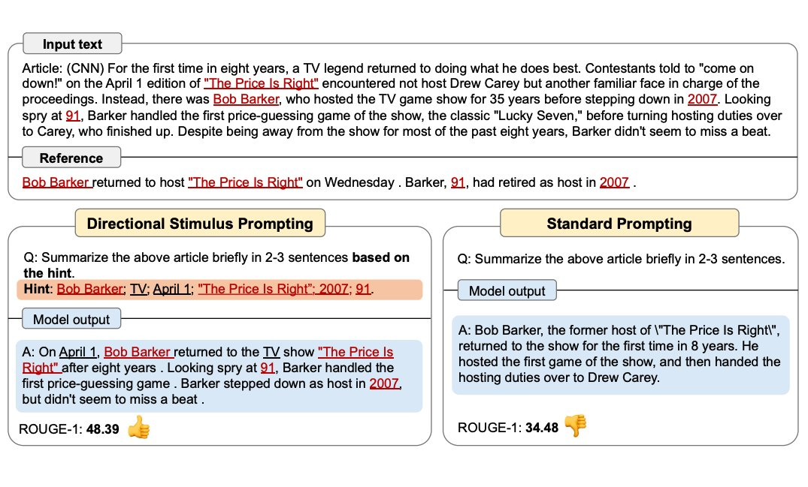

# 杂项话题

在这一部分中，我们讨论有关提示工程的其他杂项和未分类的话题。这包括相对较新的思想和方法，随着它们变得更广泛地被采用，它们最终将被移动到主要指南中。本指南的此部分也有助于跟上提示工程的最新研究论文。

**请注意，本章节正在大力开发中。**

话题：

- [杂项话题](#杂项话题)
  - [主动提示](#主动提示)
  - [定向刺激提示](#定向刺激提示)
  - [ReAct](#react)
  - [多模态CoT提示](#多模态cot提示)
  - [GraphPrompts](#graphprompts)

---

## 主动提示

基于思维链的（CoT）方法依赖于一组人工注释的固定示例。但问题在于，这些示例可能不是不同任务的最有效示例。为解决这个问题，[Diao等人 (2023年)](https://arxiv.org/pdf/2302.12246.pdf) 最近提出了一种新的提示方法，称为主动提示，以适应LLMs到不同任务特定的示例提示（用人为设计的CoT推理进行注释）。

以下是该方法的说明。第一步是使用或不使用一些CoT示例来查询LLM。对一组训练问题产生*k*个可能的答案。根据*k*个答案计算一个不确定度度量值（使用不一致性）。选择不确定度最高的问题由人员进行注释。然后使用新的注释示例来推断每个问题。

---

## 定向刺激提示

[Li等人 (2023年)](https://arxiv.org/abs/2302.11520) 提出了一种新的提示技术，以更好地指导LLM生成所需的摘要。

一个可调的策略LM被训练用于生成刺激/提示。越来越多地看到了利用RL来优化LLMs。

下图显示了定向刺激提示与标准提示的比较。策略LM可以很小，并且优化以生成引导黑盒冻结LLM的提示。

完整的示例即将推出！

---

## ReAct

[Yao等人，2022年](https://arxiv.org/abs/2210.03629)提出了一种框架，其中LLM以交替的方式生成推理跟踪和任务特定的操作。生成推理跟踪允许模型诱导、跟踪和更新行动计划，甚至处理异常。操作步骤允许与外部来源（如知识库或环境）进行接口和收集信息。

ReAct框架使LLM可以与外部工具交互，检索附加信息，从而导致更可靠和实际的响应。

完整的示例即将推出！

---

## 多模态CoT提示

[张等人（2023年）](https://arxiv.org/abs/2302.00923)最近提出了一种多模态思维链提示方法。传统的CoT聚焦于语言模态。相比之下，多模态CoT将文本和视觉整合到一个两阶段框架中。第一步涉及基于多模态信息的理由生成。接下来是第二阶段的答案推断，利用生成的信息来支持推断。

多模态CoT模型（1B）在ScienceQA基准测试上的表现优于GPT-3.5。

更多阅读：

- [语言不是你所需要的全部：将感知与语言模型对齐](https://arxiv.org/abs/2302.14045) (2023年2月)

---
## GraphPrompts

[刘等人，2023](https://arxiv.org/abs/2302.08043)介绍了GraphPrompt，一种新的图形提示框架，旨在提高下游任务的性能。

更多即将推出！

---
[上一节（可靠性）](./prompts-reliability.md)